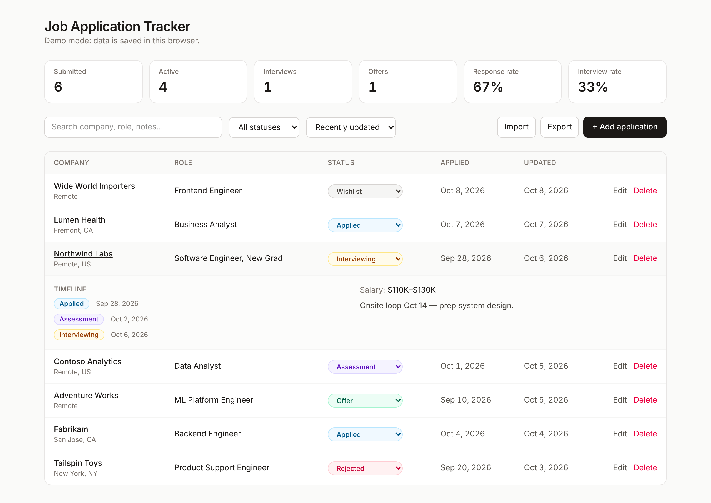

# Job Application Tracker

[](https://github.com/Tinle0301/job-application-tracker/actions/workflows/ci.yml)

A focused web app for tracking job applications from wishlist to offer. Update a status in one click, see every change on a timeline, and watch your response and interview rates as your search progresses.



## Features

- **One-click status updates** from an inline dropdown: Wishlist → Applied → Assessment → Interviewing → Offer, plus Rejected and Withdrawn.
- **Automatic timeline** for each application. Every status change is recorded with a timestamp.
- **Pipeline stats**: submitted, active, interviews, offers, response rate, and interview rate.
- **Search, filter, and sort** by company, role, notes, status, date applied, or last update.
- **Import / export JSON** to back up your data or move it between devices.
- **Two storage modes** behind one interface:
  - **Demo mode** (no setup): data is saved in your browser's `localStorage`.
  - **Supabase mode**: Postgres with magic-link auth and row-level security, so each user only sees their own applications.

## Tech stack

| Layer    | Choice                                          |
| -------- | ----------------------------------------------- |
| Frontend | React 19, TypeScript, Vite, Tailwind CSS v4     |
| Backend  | Supabase (PostgreSQL, Auth, Row-Level Security) |
| Testing  | Vitest, React Testing Library, jsdom            |
| Tooling  | oxlint, Prettier, GitHub Actions CI             |

## Architecture

```
src/
├── components/         UI: Tracker, ApplicationTable, ApplicationForm, StatsBar, Toolbar, AuthGate
├── hooks/              useApplications – state + async actions over a repository
├── lib/
│   ├── repository.ts         ApplicationRepository interface
│   ├── localRepository.ts    localStorage implementation (demo mode)
│   ├── supabaseRepository.ts Supabase implementation (production)
│   ├── stats.ts              pipeline metrics
│   ├── filters.ts            search / filter / sort
│   └── importExport.ts       JSON import validation and export
└── types.ts            Application and Status types
supabase/migrations/    schema, status-history trigger, RLS policies
```

The UI depends only on the `ApplicationRepository` interface, so the same components run against `localStorage` or Supabase. In Supabase, a Postgres trigger writes to `status_history` whenever `status` changes, so the timeline can't drift from the data, and RLS policies scope every query to `auth.uid()`.

## Getting started

```bash
git clone https://github.com/Tinle0301/job-application-tracker.git
cd job-application-tracker
npm install
npm run dev
```

Open http://localhost:5173. With no environment variables set, the app runs in **demo mode**.

### Connect Supabase (optional)

1. Create a project at [supabase.com](https://supabase.com).
2. Run the migration in `supabase/migrations/` (SQL editor, or `supabase db push` with the CLI).
3. In **Authentication → URL Configuration**, add `http://localhost:5173` (and your deployed URL) as redirect URLs.
4. Copy `.env.example` to `.env` and fill in your project URL and anon key:

```bash
VITE_SUPABASE_URL=https://your-project.supabase.co
VITE_SUPABASE_ANON_KEY=your-anon-key
```

5. Restart `npm run dev` and sign in with a magic link.

### Deploy

The app is a static Vite build, so it deploys to Vercel or Netlify as-is. Set the two `VITE_SUPABASE_*` environment variables in your hosting dashboard.

## Scripts

| Command             | Description                         |
| ------------------- | ----------------------------------- |
| `npm run dev`       | Start the dev server                |
| `npm run build`     | Type-check and build for production |
| `npm test`          | Run the test suite                  |
| `npm run lint`      | Lint with oxlint                    |
| `npm run typecheck` | Type-check without emitting         |
| `npm run format`    | Format with Prettier                |

## Import format

Import accepts a JSON array. `company` and `role` are required. Unknown statuses default to `applied`.

```json
[
  {
    "company": "Example Co",
    "role": "Software Engineer",
    "status": "applied",
    "appliedOn": "2026-10-07",
    "location": "Remote",
    "url": "https://example.com/jobs/123",
    "salary": "$100K",
    "notes": "Referred by a friend"
  }
]
```

## Roadmap

- Kanban board view with drag-and-drop between statuses
- Interview reminders and follow-up dates
- Parse application emails (Gmail API) to update statuses automatically

## License

MIT
